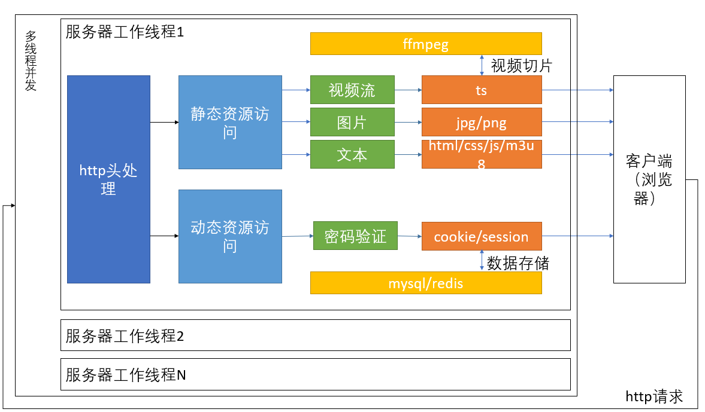
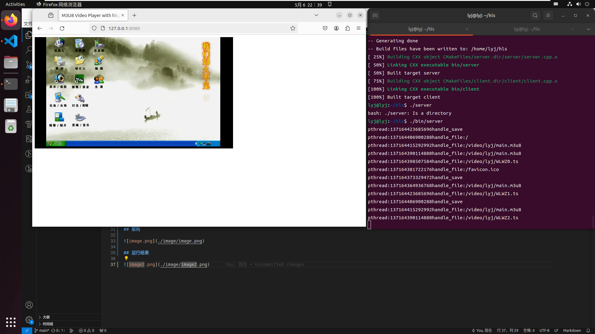

本项目使用HLS协议进行直播推流，本项目只适合学习，用来理解HLS协议、http协议以及Linux下的网络编程、多线程编程，不适合在实际生产环境中使用。

## 运行

使用cmake生成makefile

```shell
cmake .
```

使用makefile编译

```
make
```

运行服务端

```
./bin/server
```

运行推流端，推流所需的视频已经切片好

```
./bin/client
```

运行浏览器，进行拉流，浏览器中输入地址 `http://127.0.0.1:8080`

## 架构



## 运行结果

